# CoderHouse Frontend Projects

This repository contains several frontend projects developed during the CoderHouse FullStack Web Developer course. Each project showcases different skills and technologies learned throughout the course.

## Projects

### Clasica y Moderna

    
    

**Ecommerce created with ReactJS for the CoderHouse FullStack Web Developer career.**

[CHECK THE WEBSITE](https://ferbuono.github.io/clasica-y-moderna/)

[DEMO GIF](https://drive.google.com/file/d/1M_DmCH4ZiBeE46k_zf23k8LRbJRi-euN/view?usp=sharing)

#### Project Overview

The project has the book database stored at Cloud Firestore. On the website, you can find books by category, author, series, or using the search bar. You can also save them in the wishlist for a future purchase. The cart is functional, and you can see the fully detailed purchases you've made in My Orders. The user registration system, though lacking validation, allows you to add items to your wishlist and cart.

#### Screenshots

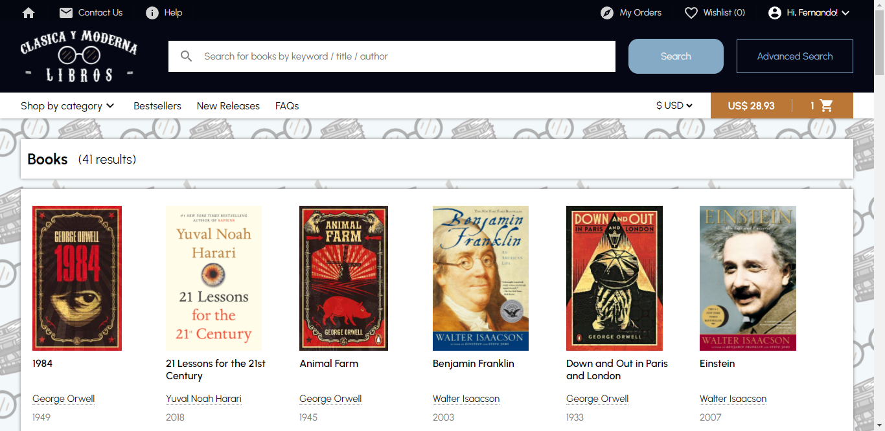
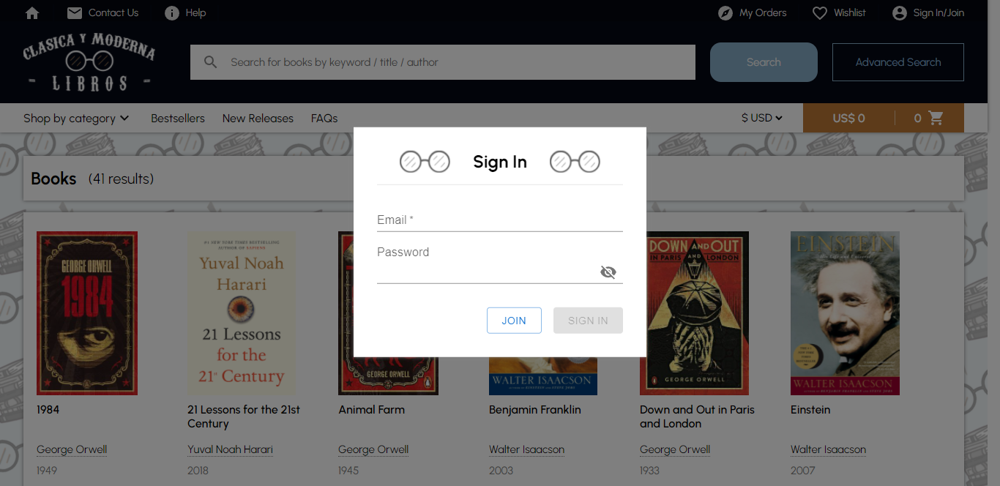
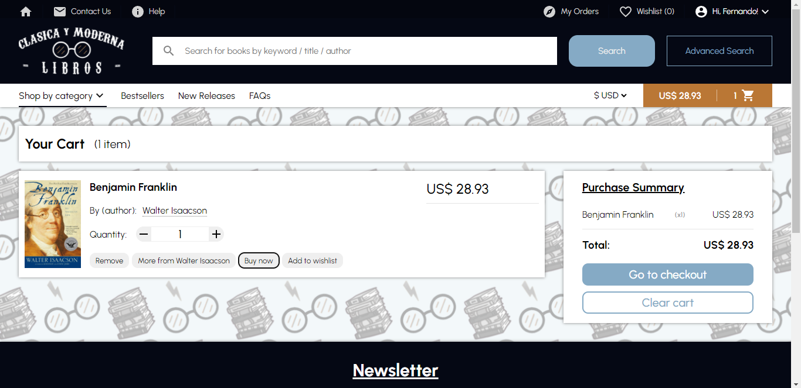
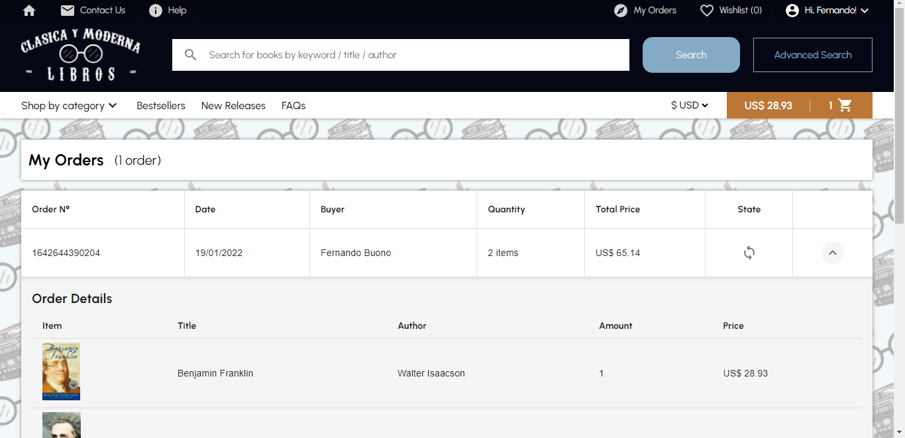

#### Technologies

- ReactJS
- React Router
- Firebase
- Styled-Components
- Material-UI
- Notistack
- React Multi Carousel

### La Familia Auto Shop

    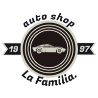
    

🚗 **Sportcars dealership created with HTML, CSS, and a bit of JavaScript for the CoderHouse FullStack Web Developer career.**

[Live Demo](https://ferbuono.github.io/la-familia-auto-shop/)

#### Project Overview

My very first project, created for the Web Developer course of the CoderHouse's Full Stack Dev career. The web is fully responsive. The pages were created with HTML, SASS was used for styling, and a minor JavaScript code was implemented to give dynamism to the header. Bootstrap was also used, particularly for the main page carousel.

#### Screenshots

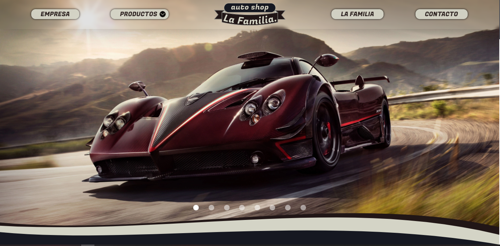
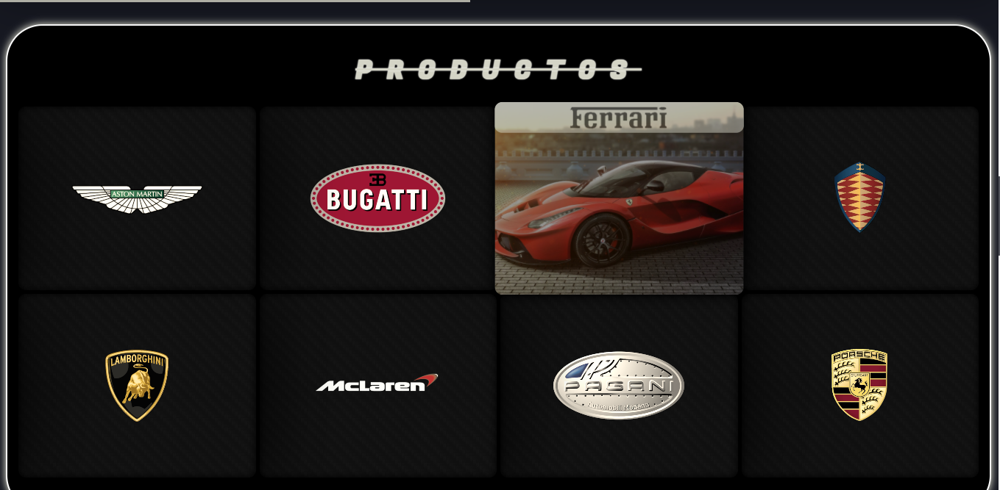
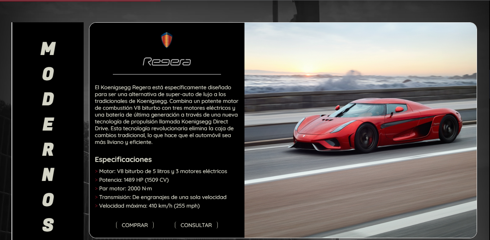
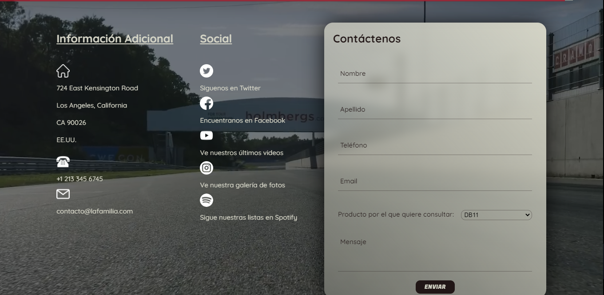

#### Technologies

- HTML
- SASS
- JavaScript
- Bootstrap
- Animate.css

### Sneaker Stash

    
    

👟 **Shoes ecommerce created with HTML, CSS, and JavaScript for the CoderHouse FullStack Web Developer career.**

[Live Demo](https://ferbuono.github.io/sneaker-stash/)

#### Project Overview

The main objective of this project was to learn how to handle objects and arrays in the most optimal way. Each brand page was created with HTML, styled with SASS, and JavaScript code was implemented to make them fully functional. A bit of jQuery was used also.

#### Screenshots

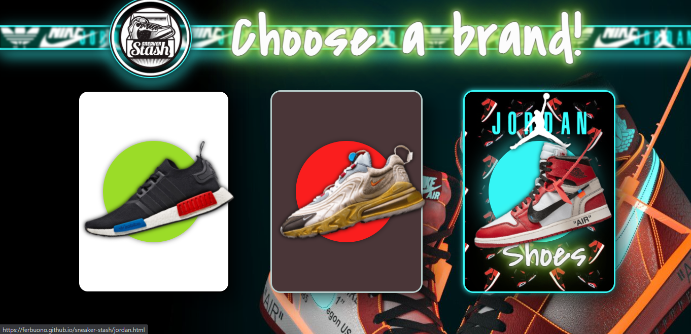
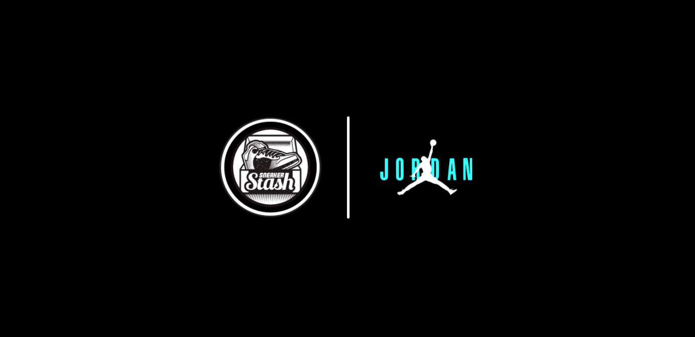
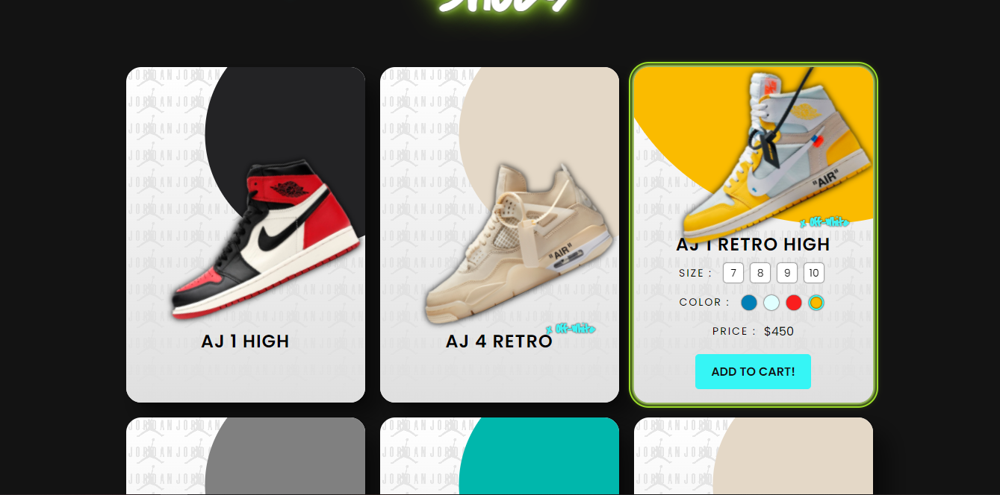
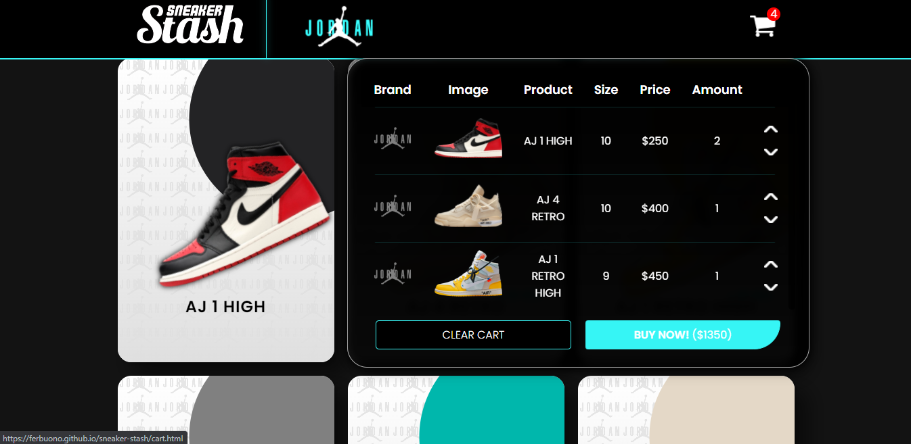
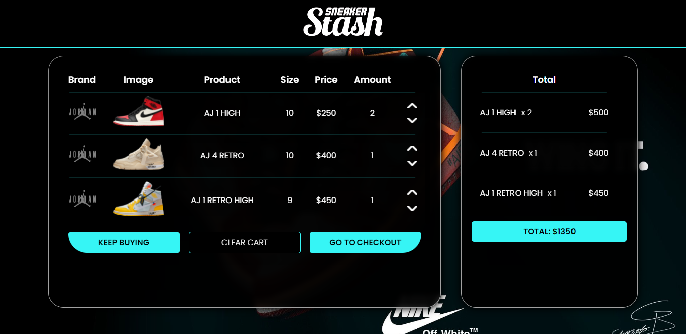

#### Technologies

- HTML
- SASS
- JavaScript
- jQuery
