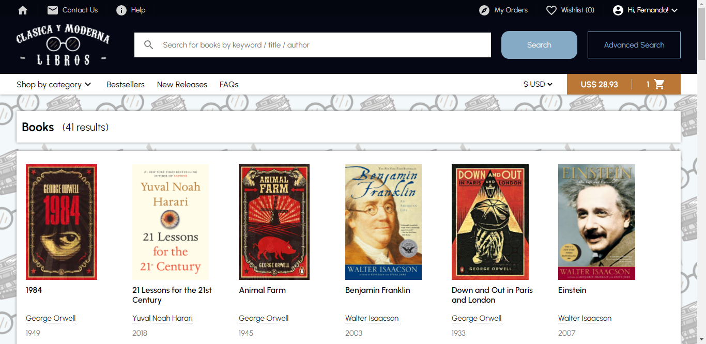
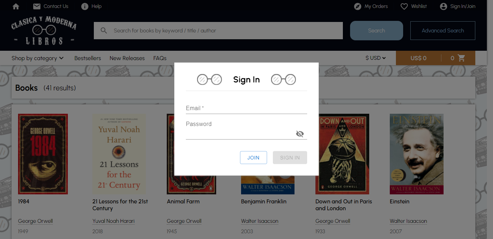
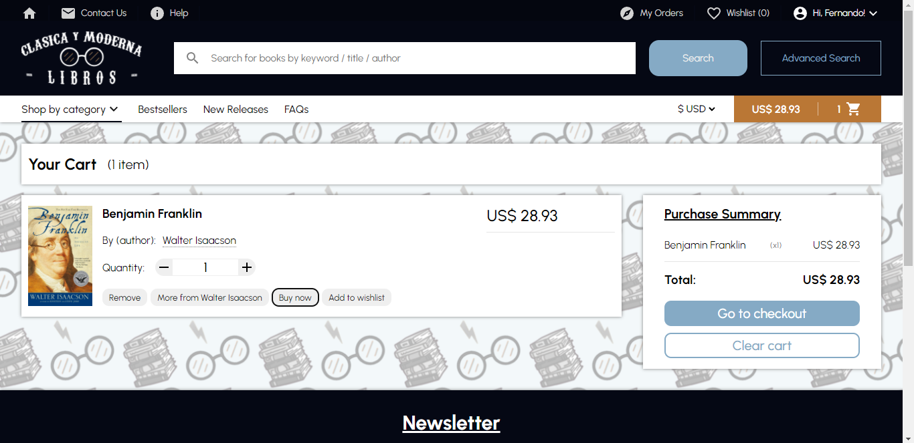
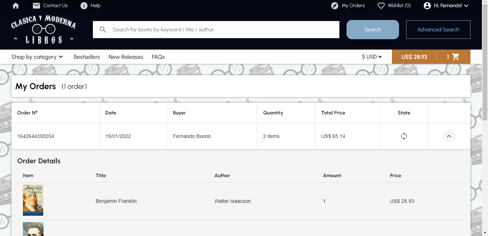

    
    

Ecommerce created with ReactJS for the CoderHouse FullStack Web Developer career.

[CHECK THE WEBSITE](https://ferbuono.github.io/clasica-y-moderna/)

[DEMO GIF](https://drive.google.com/file/d/1M_DmCH4ZiBeE46k_zf23k8LRbJRi-euN/view?usp=sharing)

## Table of Contents

* [Project overview](#project-overview)

* [Screenshots](#screenshots)

* [Technologies](#technologies)

* [Pending...](#pending)

## Project overview

The project has the book database stored at Cloud Firestore. On the website, you may find them by category, author, series, or using the search bar. You are also able to save them in the wishlist for a future purchase. The cart is functional and you can see the fully detailed purchases you've made in My Orders, whoses states will always remain as "Processing...". It also includes a user registration system, which for the moment doesn't have any kind of validation, but allows you to add items to your wishlist and to the cart. 

	
## Screenshots

## Technologies

This project was created with:
* ReactJS
* React Router
* Firebase
* Styled-Components
* Material-UI
* Notistack
* React Multi Carousel
	
## Pending...

Pending tasks:
- [ ] Responsiveness
- [ ] Allow user to add items to the cart without being signed in
- [ ] Checkout form validation
- [ ] Include a payment api
- [ ] User registration validation
- [x] Upload all 90 books to firestore database
- [ ] Add Advanced Search, Bestsellers, New Releases, FAQs and Contact Us pages